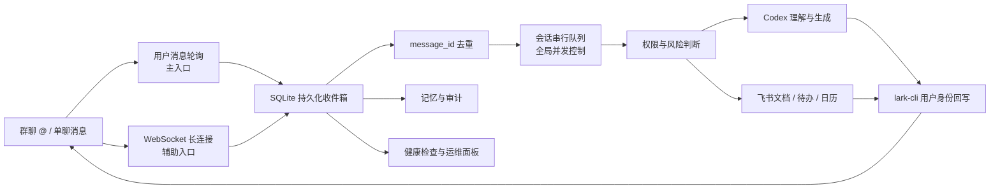

# AIPRO

> 基于真人身份运行的 AI 数字人平台<br>
> 第一开发者：赵颖知<br>
> 第二开发者：詹老师

AIPRO 是一套运行在 macOS 上的飞书 AI 数字人系统。它不是独立的机器人账号，而是在账号本人明确授权后，读取发给该真人账号的群聊 `@` 和单聊消息，调用 Codex 完成理解、问答与工作处理，再通过飞书用户 OAuth 以该账号身份回复。

系统采用“用户消息轮询为主、WebSocket 长连接为辅”的双入口架构，并保留持久化队列、消息去重、失败重试、会话记忆、操作审计、限流、真人接管和独立运维面板。

> 这是账号所有者自用的自动化工具。它不会绕过飞书授权，也不应被用于未经授权的账号、隐瞒式冒充、付款、签约、正式承诺或其他高风险动作。

## 核心特点

| 能力 | 当前实现 |
| --- | --- |
| 真人身份收发 | 使用官方 `lark-cli --as user` 读取和发送消息 |
| 群聊触发 | 所有可见群聊均可用，但只有明确 `@` 真人账号才响应 |
| 单聊触发 | 别人发给账号本人的单聊直接响应 |
| 双入口监听 | 5 秒用户消息轮询为主，`im.message.receive_v1` WebSocket 为辅 |
| 去重与排队 | SQLite 以 `message_id` 唯一去重；同一会话串行处理 |
| AI 执行 | Codex 临时会话、隔离运行目录、只读沙箱 |
| 上下文记忆 | 按“会话 + 对方”保存近期对话，避免不同联系人串话 |
| 文件能力 | 支持图片、PDF、DOCX 和常见文本文件读取；可生成 DOCX 并回传 |
| 飞书工作能力 | 授权资料检索、日历查询、待办和日程预览后创建 |
| 安全边界 | L0–L3 风险分级；变更类动作仅账号本人可确认 |
| 高可用机制 | LaunchAgent 守护、指数退避、三次处理尝试、死信与恢复 |
| 运维能力 | 本机状态面板、飞书“状态/帮助”命令、macOS 断线通知 |
| 回复标识 | 默认不添加固定 AI 前缀，`digitalTwinLabel` 可自行配置 |

## 系统架构



### 一条消息的完整生命周期

1. 主轮询同时搜索群聊和单聊中的新消息；辅助 WebSocket 接收实时事件。
2. 群聊只保留 `@ ownerOpenId` 的消息，单聊只保留别人发来的消息，并排除账号本人发送的内容。
3. 两个入口都写入同一个 SQLite 收件箱，以飞书 `message_id` 原子去重。
4. 消息按会话串行处理，避免同一群里多条回复乱序；不同会话默认最多并发 2 条。
5. 系统判断问答、资料、图片、文件、报告、待办、日程及风险等级。
6. 普通内容交给 Codex；需变更真实工作状态的动作先预览、再等账号本人确认。
7. 最终内容通过 `lark-cli im +messages-send --as user` 回到原会话。
8. 处理结果、失败、重试、确认和关键健康状态写入本地审计库。

## 监听与可靠性机制

### 主入口：用户消息轮询

- 默认每 `5000ms` 轮询一次。
- 同时查询 `group` 和 `p2p`，并自动翻页。
- 每个轮询窗口默认向前重叠 3 分钟，抵御搜索索引延迟和短暂网络抖动。
- 断线恢复后最多追赶 24 小时内的消息。
- 若搜索结果提示仍有未取完页面，程序拒绝推进游标，避免静默漏消息。
- 首次启动只建立历史基线，不会突然回复启动前已有的旧消息。

### 辅助入口：WebSocket

- 默认由官方 `lark-cli event consume im.message.receive_v1` 维持。
- WebSocket 负责降低正常情况下的触达延迟，但不是唯一入口。
- 消费者退出后由监督循环指数退避重启。
- 可以将 `eventTransport` 改为 `sdk`，直接使用飞书 Node SDK 长连接。

### 队列、重试与恢复

- 相同 `message_id` 无论从轮询还是 WebSocket 到达，都只处理一次。
- 处理失败会按指数退避重试，默认最多尝试 3 次。
- 连续失败且无法发送错误提示的消息进入死信状态，面板和健康检查会报警。
- 进程异常退出后，处于 `processing` 的消息会在下次启动时重新进入待处理队列。
- 默认每位非账号本人用户 5 分钟最多触发 10 条，防止群聊刷屏或意外循环。
- 已完成消息默认保留 30 天；审计与会话记录默认保留 90 天。

## 能力与触发方式

### 直接执行

- 普通问答、总结、改写、翻译、起草回复。
- 图片理解及最近图片上下文追问。
- PDF、DOCX、TXT、Markdown、CSV、JSON、XML、HTML 等文件内容提取。
- 生成结构化 Word 报告并发送回原会话。
- 查询已授权的飞书文档与资料。
- 查询提问者有权访问的今明后日历安排。

主轮询以文字指令为触发入口。处理图片或文件时，推荐先发送附件，再在同一会话补一句“总结刚才的文件”或“看看上面的图片”。AIPRO 会在同一发送者最近 30 分钟的消息中安全回查附件，不会读取其他联系人发送的文件。

### 必须预览并确认

- 创建飞书待办。
- 创建飞书日程。
- 从会议纪要提取行动项并批量创建待办。
- 任何会影响真实工作状态或外部对象的操作。

变更类动作只接受 `ownerOpenId` 对应的账号本人确认。其他联系人可以让 AIPRO 帮忙整理草稿，但不能借此代表账号本人创建待办或日程。

### 内置操作命令

| 消息 | 作用 |
| --- | --- |
| `状态` | 查看轮询、WebSocket 和队列健康；账号本人可见详细状态 |
| `帮助` | 查看使用方式和本机面板地址 |
| `暂停接管` | 账号本人暂停当前会话的自动回复 |
| `恢复接管` | 账号本人恢复当前会话的自动回复 |

## 运行要求

- macOS 13 或更高版本。
- Node.js `22.5+`；项目使用内置 `node:sqlite`。
- Python 3.10+；`setup.sh` 会安装 `python-docx` 与 `pypdf`。
- pnpm（推荐）或 npm。
- 已安装并登录 Codex CLI，或安装了包含 Codex 可执行文件的 ChatGPT macOS 应用。
- 飞书官方 CLI：`@larksuite/cli`。
- 一个由账号本人或组织合法管理的飞书自建应用。

安装飞书 CLI：

```bash
pnpm add -g @larksuite/cli
# 或
npm install -g @larksuite/cli
```

## 快速部署

### 1. 获取代码

```bash
git clone https://github.com/James19890801/feishu-codex-digital-employee.git
cd feishu-codex-digital-employee
chmod +x scripts/*.sh
./scripts/setup.sh
```

`setup.sh` 会：

- 检查 Node.js、Python、Codex 和 `lark-cli`；
- 安装 Node 与 Python 依赖；
- 创建 `config.local.json`、`PERSONA.md`、`BIBLE.md`；
- 创建本地数据目录。

### 2. 准备飞书应用

在飞书开放平台完成以下配置：

1. 创建自建应用并取得 App ID。
2. 为应用订阅长连接事件 `im.message.receive_v1`。
3. 根据需要申请消息、资源、文档、搜索、待办和日历权限。
4. 发布应用版本并确保账号本人可使用该应用。

用户 OAuth 至少授权：

```text
offline_access
search:message
im:message
im:message:readonly
im:message.group_msg:get_as_user
im:message.p2p_msg:get_as_user
im:message.send_as_user
```

登录并验证：

```bash
lark-cli auth login --scope 'offline_access search:message im:message im:message:readonly im:message.group_msg:get_as_user im:message.p2p_msg:get_as_user im:message.send_as_user'

lark-cli auth check \
  --scope 'search:message im:message im:message:readonly im:message.group_msg:get_as_user im:message.p2p_msg:get_as_user im:message.send_as_user' \
  --json
```

结果必须包含：

```json
{
  "ok": true
}
```

### 3. 填写本机配置

复制文件由 `setup.sh` 自动完成。编辑 `config.local.json`：

```json
{
  "feishuAppId": "cli_xxxxxxxxxxxxxxxx",
  "ownerOpenId": "ou_xxxxxxxxxxxxxxxx",
  "authorizedChatIds": [],
  "allowAllChats": true,
  "digitalTwinLabel": "",
  "eventTransport": "lark-cli",
  "pollIntervalMs": 5000,
  "maxConcurrentReplies": 2,
  "dashboardPort": 17655,
  "codexModel": "gpt-5.6-terra"
}
```

当前默认策略：

- `allowAllChats: true`：不设置会话白名单。
- `authorizedChatIds: []`：不限制群聊或单聊范围。
- 群聊仍必须明确 `@` 账号本人。
- 单聊直接触发。
- `digitalTwinLabel: ""`：回复不添加固定 AI 标签。

> “所有会话可用”不等于自动群发，也不代表读取所有聊天内容。程序只搜索别人发给账号本人的单聊，以及群内明确 `@` 账号本人的消息。

### 4. 配置身份与工作规则

编辑以下文件：

- `PERSONA.md`：职业背景、服务对象、语气、表达习惯和真实消息样本。
- `BIBLE.md`：允许直接执行、需要确认和禁止执行的工作规则。
- `knowledge-catalog.json`：给非账号本人开放的飞书资料及读者范围。

建议在 `PERSONA.md` 中放入 10–20 条去除隐私后的本人真实表达样本。仅写“专业、亲切”通常不足以稳定复现语言风格。

资料目录示例：

```json
[
  {
    "token": "doxcn_xxxxxxxxxxxxxxxx",
    "title": "项目说明",
    "url": "https://example.feishu.cn/docx/doxcn_xxxxxxxxxxxxxxxx",
    "aliases": ["项目资料", "项目文档"],
    "readerOpenIds": ["ou_xxxxxxxxxxxxxxxx"]
  }
]
```

账号本人可以检索应用权限范围内的飞书资料；其他联系人只能读取目录中明确列出且 `readerOpenIds` 授权给他的文档。

### 5. 配置可选 SDK 凭据

文字轮询和用户身份回复不需要把 App Secret 写进项目文件。图片、文件、飞书文档、待办、日历，以及 `eventTransport: "sdk"` 需要飞书 SDK 业务凭据。

将 App Secret 放进专用 macOS 钥匙串项：

```bash
security add-generic-password -U \
  -a 'cli_你的AppID' \
  -s 'codex-feishu-digital-employee' \
  -w '你的AppSecret'
```

如果后台进程出现 `keychain access blocked`，只有在接受“同一 macOS 用户下的进程可读取本地密钥文件”这一安全影响后，才执行：

```bash
lark-cli config keychain-downgrade
```

不要把 App Secret、OAuth token、验证码、`config.local.json` 或本地 SQLite 数据提交到 GitHub。

### 6. 安装常驻服务

```bash
./scripts/install-service.sh
./scripts/install-dashboard-service.sh
./scripts/verify.sh
```

两个独立 LaunchAgent：

| 服务 | LaunchAgent | 作用 |
| --- | --- | --- |
| AIPRO 主进程 | `com.local.feishu-codex-digital-employee` | 监听、队列、Codex 和回复 |
| AIPRO 运维面板 | `com.local.feishu-codex-dashboard` | 独立看门人和状态 API |

## 配置字段

### 身份与范围

| 字段 | 默认值 | 说明 |
| --- | --- | --- |
| `feishuAppId` | 必填 | 飞书自建应用 App ID |
| `ownerOpenId` | 必填 | 被代理的真人账号 open_id |
| `allowAllChats` | `true` | 是否允许所有可见会话触发 |
| `authorizedChatIds` | `[]` | 关闭全会话模式时使用的 chat_id 白名单 |
| `digitalTwinLabel` | `""` | 回复前缀；空字符串表示不添加 |
| `actionItemDocumentToken` | `""` | 会议纪要行动项来源文档，可选 |

### 监听与可靠性

| 字段 | 默认值 | 说明 |
| --- | --- | --- |
| `eventTransport` | `lark-cli` | WebSocket 实现：`lark-cli` 或 `sdk` |
| `pollIntervalMs` | `5000` | 主轮询间隔 |
| `pollOverlapMs` | `180000` | 每次轮询向前重叠范围 |
| `pollInitialLookbackMs` | `900000` | 首次启动建立基线的回看范围 |
| `pollMaxCatchupMs` | `86400000` | 断线后最大追赶范围 |
| `pollWindowMs` | `900000` | 单次搜索时间窗口 |
| `maxConcurrentReplies` | `2` | 不同会话的全局回复并发数，最大 4 |
| `rateLimitWindowMs` | `300000` | 非账号本人用户限流窗口 |
| `rateLimitMaxMessages` | `10` | 每个限流窗口允许的触发数 |

### 运行时与超时

| 字段 | 默认值 | 说明 |
| --- | --- | --- |
| `larkCliTimeoutMs` | `45000` | 飞书 CLI 调用超时 |
| `codexTimeoutMs` | `120000` | 单次 Codex 执行超时 |
| `helperTimeoutMs` | `30000` | Python 文件处理超时 |
| `dashboardPort` | `17655` | 本机面板端口 |
| `artifactDir` | 桌面“数字员工交付物” | 生成文件目录 |
| `codexBin` | ChatGPT 应用内 Codex | Codex 可执行文件 |
| `codexModel` | `gpt-5.6-terra` | Codex 模型 |
| `codexProxyUrl` | `""` | 可选 HTTP/HTTPS 代理 |
| `larkCli` | `~/.local/bin/lark-cli` | 飞书 CLI 路径 |
| `nodeBin` | Codex 内置 Node 目录 | Node 运行时目录 |
| `pythonBin` | Codex 内置 Python | Python 解释器路径 |

所有整数配置均有边界校验。非法端口、超时、轮询间隔、并发数、App ID、open_id 或事件传输方式会在启动时直接报错，而不是带病运行。

## 运维面板

浏览器打开：

[http://127.0.0.1:17655](http://127.0.0.1:17655)

面板只监听 `127.0.0.1`，不会暴露到局域网或互联网。它与主进程分开运行，因此主进程崩溃后仍可看到状态并执行重启。

面板展示：

- 主进程 PID 和启动时间；
- 消息轮询游标、最后成功时间和耗时；
- WebSocket 消费者数量；
- Codex 代理可达性；
- SQLite 完整性；
- 待处理、处理中、失败和死信数量；
- 最近的安全化审计事件；
- 当前触发范围、回复标签和监听模式。

页面每 5 秒刷新。正常、部分恢复、断线和完全恢复会触发 macOS 本地通知。

## 常用运维命令

```bash
# 查看主服务
launchctl print "gui/$(id -u)/com.local.feishu-codex-digital-employee"

# 查看面板服务
launchctl print "gui/$(id -u)/com.local.feishu-codex-dashboard"

# 重启主服务
launchctl kickstart -k "gui/$(id -u)/com.local.feishu-codex-digital-employee"

# 查看日志
tail -f bridge.log bridge-error.log
tail -f dashboard.log dashboard-error.log

# 只读健康检查
npm run health
npm run event-health

# 真实 Codex 采样
npm run codex-smoke

# 完整本机验收
./scripts/verify.sh
```

## 验收清单

### 自动验收

`./scripts/verify.sh` 会依次验证：

1. JavaScript、配置和 Python 依赖；
2. 全部自动化测试；
3. 真实 Codex 模型调用；
4. SQLite 完整性、轮询新鲜度、积压、失败与代理；
5. 飞书用户 OAuth 权限；
6. WebSocket 应用和消费者状态；
7. 两个 LaunchAgent；
8. 运维面板 API。

### 真实消息验收

自动测试不能代替飞书端到端送达。上线前至少完成：

1. 在群里发送 `@账号本人 你在吗`，确认秒级或数秒内回复。
2. 给账号本人发单聊，确认无需 `@` 也能回复。
3. 同一消息同时经轮询和 WebSocket 到达时，只回复一次。
4. 发送图片并继续追问“上面这张图是什么意思”。
5. 发送 PDF 或 DOCX，再补一句“总结刚才的文件”，确认可以回查并读取附件。
6. 要求生成 Word 报告并确认文件能正常打开。
7. 要求创建待办或日程，确认必须先预览，账号本人回复“确认”后才执行。
8. 测试“暂停接管”和“恢复接管”。
9. 重启主进程，确认旧消息不回放、处理中消息可恢复。
10. 断开网络再恢复，确认轮询游标继续推进且面板恢复正常。

更详细的逐项记录见 [`docs/提交验收单.md`](docs/提交验收单.md)。

## 项目结构

```text
.
├── dashboard/                 # AIPRO 本机运维界面
├── docs/                      # 验收单与高可用/安全审计
├── scripts/
│   ├── setup.sh               # 初始化与安装依赖
│   ├── install-service.sh     # 安装主进程 LaunchAgent
│   ├── install-dashboard-service.sh
│   ├── verify.sh              # 完整本机验收
│   ├── health-check.mjs       # 队列与 SQLite 健康检查
│   ├── event-health.mjs       # WebSocket 消费者检查
│   └── codex-smoke.mjs        # 真实 Codex 采样
├── src/
│   ├── index.mjs              # 消息入口、工作流、Codex 与飞书回写
│   ├── polling.mjs            # 用户消息搜索、过滤和轮询窗口
│   ├── state.mjs              # SQLite 队列、记忆、审计和限流
│   ├── reliability.mjs        # 校验、健康状态和可靠性策略
│   ├── process-runner.mjs     # 子进程超时、输出上限和安全终止
│   ├── dashboard-server.mjs   # 本机看门人与状态 API
│   ├── artifact_writer.py     # DOCX 生成
│   └── extract_file_text.py   # PDF/DOCX/文本提取
├── templates/                 # Persona 与 Bible 模板
├── config.example.json        # 无敏感信息的配置样例
├── knowledge-catalog.json     # 飞书资料授权目录
├── requirements.txt           # Python 依赖
└── package.json               # Node 依赖与命令
```

以下本机文件不会提交到 GitHub：

```text
config.local.json
PERSONA.md
BIBLE.md
data/
*.log
node_modules/
__pycache__/
```

## 安全与隐私

- App Secret 存在 macOS Keychain，不写入源码。
- 用户 OAuth 由官方 `lark-cli` 管理。
- `config.local.json`、Persona、Bible、日志、SQLite 和生成物默认被 Git 忽略。
- Codex 使用临时会话、隔离目录和只读沙箱，不允许根据飞书消息任意操作本机。
- 文件最大 20 MB；文档正文最多向模型提供 40,000 字符。
- 面板执行重启时校验 Host、Origin 和自定义请求头。
- 面板设置 CSP、拒绝 iframe、禁用缓存，并只监听本机回环地址。
- 非账号本人不能确认待办、日程等真实变更动作。
- 付款、转账、签约、录用、法律或财务承诺、验证码和私钥处理、不可逆删除属于禁止自动执行范围。

详细设计与剩余边界见 [`docs/高可用与安全审计报告.md`](docs/高可用与安全审计报告.md)。

## 已知边界

- 当前是单台 Mac 上运行的个人/小团队系统，不是多节点云服务。
- Mac 关机、休眠或断网时无法实时回复；恢复后由轮询补追，默认最多 24 小时。
- 正常响应速度取决于飞书搜索索引、网络、Codex 推理时间和消息发送耗时，不能承诺固定 1 秒内回复。
- 文字问答和用户身份回复依赖用户 OAuth；图片、文件、飞书资料、待办、日历依赖额外应用权限与 App Secret。
- `node:sqlite` 在当前 Node 版本仍可能显示实验性警告，这不等于健康检查失败。
- “不添加 AI 固定标签”只是展示配置，不应被用于欺骗或代替本人做高风险承诺。
- 要达到跨机器、跨网络故障容灾，需要迁移到云端队列、托管数据库和多实例部署，这不属于当前单机版本。

## 故障排查

### 群里 `@` 后没有回复

1. 确认 `ownerOpenId` 是真人账号，而不是应用 open_id。
2. 确认消息确实 `@` 了账号本人。
3. 执行 `lark-cli auth check ... --json` 检查用户 OAuth。
4. 执行 `npm run health`，观察轮询游标是否新鲜。
5. 查看 `bridge-error.log`。

### 单聊没有回复

- 确认单聊消息是别人发给账号本人的，不是账号本人自己发出的。
- 检查 `search:message` 和 `im:message.p2p_msg:get_as_user`。
- 检查是否在该会话发送过“暂停接管”。

### 收到消息但 Codex 没有返回

- 先执行 `npm run codex-smoke`。
- 检查 Codex 是否已登录。
- 如需代理，填写可信的 `codexProxyUrl`。
- 检查 `codexTimeoutMs` 和 `bridge-error.log`。

### 文字正常，图片、文件、待办或日历不可用

- 检查 App Secret 是否已写入正确的 Keychain service。
- 检查应用版本和相应飞书权限是否已发布。
- 检查 Python 依赖：`npm run check`。
- 确认操作人为账号本人；其他联系人不能确认真实变更动作。

### 面板打不开

```bash
launchctl print "gui/$(id -u)/com.local.feishu-codex-dashboard"
curl --fail http://127.0.0.1:17655/api/status
tail -100 dashboard-error.log
```

### WebSocket 断线

```bash
npm run event-health
lark-cli event status --json --fail-on-orphan
```

只要主轮询健康，WebSocket 暂时断线不会让系统完全失去消息入口，但面板会显示需要维护。

## 开发与测试

```bash
# 安装锁定依赖
pnpm install --frozen-lockfile

# 配置、语法和 Python 依赖
npm run check

# 自动化测试
npm test

# 完整验收
./scripts/verify.sh
```

测试覆盖消息筛选、分页完整性、轮询窗口、SQLite 原子领取、去重、恢复、重试、限流、会话串行、子进程超时、单实例锁、运维模型、操作命令、通知策略和 WebSocket 消费者。

---

第一开发者：赵颖知<br>
第二开发者：詹老师
