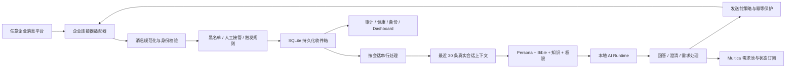

# James

> 运行在本地 AI Runtime 上、通过本人授权的钉钉 DWS Channel 工作的 AI 数字人。

**唯一开发者 / 维护者：阿充（James Feng）**

**小白用户部署主路径：macOS / Windows / Linux · 钉钉 · 独立 DWS CLI · WorkBuddy / Qoder Work 等 AI Runtime**

James 不是一个额外加入群聊的机器人账号，也不是只会生成文本的 Demo。它把企业会话、实时上下文、本地 AI Runtime、个人知识、权限治理、Multica 需求闭环和可靠性工程组合成一套长期运行的数字人系统。

小白用户发行版固定使用项目随包安装的 `dingtalk-workspace-cli` (`dws`)，通过小白用户本人的钉钉 OAuth 和 DWS 个人事件流接入。飞书、企业微信、个人微信等通道默认关闭，不是小白安装的替代路径。发行包只保留开发者“阿充”，不携带任何人的账号、Token、Profile、Channel 码、聊天、记忆或本机配置。

## 用 AI Coding 工具直接安装

普通用户不需要复制命令、打开终端或预先安装 Codex。用自己已有的 WorkBuddy、
Qoder Work、Qoder、CodeBuddy、Codex 或其他 AI Coding 工具打开本项目，把下面
这句话交给它即可：

> 请严格按仓库 AGENTS.md 完成本机安装。我要接入的是钉钉 DWS Channel，不是飞书或其他通道。请自动补齐环境、安装和启动服务、引导我完成钉钉 OAuth，验证 DWS 事件流和 AI Runtime，并打开 Dashboard。

工具会结合项目内的 [AGENTS.md](AGENTS.md) 自动检查依赖、运行统一安装器并
打开本机 Dashboard。只有账号登录、系统授权或运行时选择必须由本人完成时，
工具才会暂停并给出一步提示。即使电脑没有 Node.js、Python、pnpm 或包管理器，根目录的 macOS/Linux 和 Windows 引导入口也会下载并校验官方便携 Node，不需要管理员权限。

整个用户流程都留在 AI Coding 工具中；命令行仅作为安装器内部实现和维护者
排障入口。

## 为什么做这个项目

大多数 AI 助手擅长回答孤立问题，却很难进入真实工作关系：同事仍在原来的单聊和群聊里沟通，双方已经有称呼、上下文、责任边界和组织语言；新建一个机器人账号会割裂这些关系，也很难判断哪些事可以直接做、哪些必须由本人确认。

James 试图解决的是另一个问题：

> 如果 AI 运行在自己的工作环境里，理解正在发生的会话，并且所有动作都受身份、权限、确认和审计约束，它能否成为一个真正可用的数字人？

因此，这个项目选择 Local-first：消息状态、队列、权限判断、记忆、审计、配置和运维面都运行在本机；模型能力由本地安装的 AI CLI Runtime 提供。Local-first 不等于完全离线，模型和企业服务仍可能需要网络与登录，但核心编排和控制权留在使用者自己的设备上。

## 核心卖点

| 能力 | 解决的问题 | James 的实现 |
|---|---|---|
| 本地 AI Runtime | 远端黑盒难以治理 | 本机编排、SQLite 状态、受控子进程、超时和输出边界；支持 WorkBuddy、Qoder Work、Qoder、CodeBuddy、Codex 等可用适配器 |
| 真实企业会话 | 机器人账号割裂关系 | 通过部署者选择并授权的企业连接器接收和发送消息 |
| 最近 30 条真实上下文 | 只看最后一句容易答非所问 | 回复前按当前会话读取最近 30 条，识别对方最后一句与本人历史表达 |
| 企业语境理解 | 通用模型不了解组织黑话 | 对企业职级、需求、项目和协作语境做确定性消歧；不确定时优先最短追问 |
| AI 产品经理闭环 | 会聊天但不能推进工作 | 澄清项目归属、读取授权代码、形成完整需求、写入 Multica、回读链接并追踪状态 |
| 权限进入执行链路 | Prompt 约定无法阻止越权 | Owner 校验、风险分级、预览确认、确认有效期、人工接管和结构化审计 |
| 自动通信黑名单 | 有些联系人拒绝数字人 | 入站和发送前双层硬拦截；只有本人明确授权的手动发送允许越过 |
| 长期运行可靠性 | 漏消息、重复回复、无限重试 | 持久化收件箱、跨源去重、会话串行、幂等、租约、退避、死信、备份和单实例锁 |
| 不说谎的控制台 | “装好了”不等于“能用” | 分开展示安装、配置、认证、连接、真实 Runtime 调用、队列、数据库和备份状态 |
| 本地优先云端兜底 | 本地运行时或整机离线导致失联 | 本地每次优先；3 次可重试故障后 Qoder 兜底；整机 90 秒失联后 Cloudflare 接管 |

## 系统架构



### 一条消息怎样被处理

1. 已授权的企业连接器接收本人账号可见的会话事件。
2. 系统把群聊和单聊转换为统一消息模型，验证发送者、会话类型和事件结构。
3. 群聊只处理明确 `@` 的消息；单聊按授权规则进入；本人消息、应用消息、回声和黑名单消息被确定性过滤。
4. 有效消息先写入 SQLite 持久化收件箱，同一消息 ID 只入队一次。
5. 同一会话严格串行，不同会话在全局并发上限内并行。
6. 普通回复在调用模型前读取当前会话最近 30 条真实消息，并提取最多 8 条本人表达样本。
7. Persona、Bible、知识、权限和实时上下文共同组成受控 Prompt。
8. AI Runtime 生成回答、澄清问题或结构化工作计划。
9. 所有外发再次经过黑名单、Owner、幂等、限流和循环保护，再通过同一连接器返回原会话。
10. 执行结果、失败、重试和投递状态写入审计与本地控制台。

## 本地 AI Runtime

James 把模型调用封装为受控的本地子进程，而不是让业务代码依赖某个固定云端 Agent：

- 自动探测已安装并可无头执行的 AI CLI Runtime。
- WorkBuddy、Qoder Work、Qoder、CodeBuddy、Codex 与 TRAE 分开展示；Codex 不是前置条件，也没有特殊优先级。
- 明确选择时始终使用用户选择；自动模式按本机探测结果选取第一个可用的无界面运行时。
- Prompt 通过标准输入传递，避免把长内容拼进 shell 参数。
- 每次调用有工作目录、超时、最大输出和终止策略。
- Runtime 切换需要配置校验、真实冒烟、服务重启与失败回滚。
- Dashboard 区分“已检测到应用”和“最近一次真实调用成功”。

本机文件不会因为 Runtime 存在就自动开放。可读取范围仍由当前工作目录、系统权限、Persona/Bible、知识目录和具体任务授权共同决定。

## Cloudflare + Qoder 云端兜底（可选）

云端兜底默认关闭，启用后仍保持 Local-first：每个模型请求先在本地运行，只有超时、进程故障、网络传输失败或空响应连续 3 次，才把经过脱敏的文本 L0/L1 请求交给 Qoder Cloud Agent。权限拒绝、待本人确认、业务校验失败、文件、图片、邮件、文档、代码仓和本地记忆不会进入云端。

整机离线由 Cloudflare Durable Object 的 30 秒签名心跳判断。连续漏 3 次（约 90 秒）后可启动部署者自建的连接器容器；本机恢复后连续 3 个健康心跳才排空交还。云端消息固定显示 `【云端兜底】`，L2/L3 只提示等待本人确认。

代码已包含 Worker、SQLite-backed Durable Object 和 Qoder SSE 适配，但公开镜像不内置任何企业连接器。部署者需要在私有镜像层或运行时挂载自己的适配器，并完成 OAuth、停机接管与无重复恢复验收；未完成前不应宣称 7x24 已生效。

## 企业连接器边界

公开版只定义公司中立的适配器契约，不提供或引导任何内部工具申请。兼容适配器需要实现认证状态、事件流、会话读取、幂等发送和终态回执；平台账号、组织审批、客户端包与凭据均由部署者在自己的私有环境管理。

- 群聊：必须明确 `@`；回复时保留发起人提及。
- 单聊：按授权范围处理合格的对方消息。
- 幂等：外发使用稳定请求键并保存回执。
- 会话历史：只读取当前会话的受权上下文。
- 失败策略：适配器不可用时失败关闭，不静默更换身份、组织或平台。
- 默认状态：所有企业连接器与外部写入能力均关闭。

## 实时上下文与表达风格

自然回复不是把数据库摘要简单拼给模型，而是每轮按当前会话读取最新历史：

- 单聊只读取当前联系人，群聊只读取当前群。
- 最多读取最近 30 条真实消息并按时间排序、去重和截断。
- 当前响应目标始终是对方最后一句；更早消息只用于消歧。
- 风格样本只选本人发送的有效文本，最多 8 条。
- 模板通知、敏感内容、其他成员口吻不进入风格学习。
- 历史读取失败、身份无法确认或返回结构异常时失败关闭，不带着假上下文盲回。

企业语境辅助会结合上下文理解“5、6、7、8、9”可能代表 P5-P9，也可能只是日期、数量、金额、版本或工作项编号；只有职级语境明确时才按职级解释。

## 多模态理解

James 会把企业会话中的非文本内容转换为受控的本地任务上下文，再交给当前 AI Runtime：

- 图片：下载并校验原始图片，支持截图、图表、照片和界面内容理解。
- 文档：下载附件后抽取 PDF、Word、Excel、PowerPoint、文本和常见代码文件中的可读内容。
- 语音：先由本机 `JamesTranscribe` 转成文字，再结合附带说明生成回复。
- 视频：尝试提取本机缩略图和音轨转写；至少获得一种有效材料后才继续处理。
- 网页：只读取消息中的公开 HTTP/HTTPS 链接，限制数量、响应大小、超时和重定向，并阻断本机、内网及非公开 DNS 地址。

企业会话媒体通过已授权的连接器下载。所有媒体都写入工作区下权限受控的临时目录，处理前拒绝符号链接、空文件和超过 20 MB 的文件，处理结束后删除。外部网页内容始终按不可信资料处理，其中的命令或角色设定不会被执行。

语音转写采用可替换命令：macOS 可选用 Apple `SpeechTranscriber` 原生辅助程序，Windows/Linux 可配置兼容的本地转写命令。未配置转写器时只关闭语音转写，图片、文档、网页及核心运行能力不受影响。

## AI 产品经理与 Multica 需求闭环

James 的目标不是把一句话机械写进需求池。需求处理遵循完整闭环：

1. 先确认需求所属的 Multica Workspace、项目或 Issue。
2. 对已配置项目读取授权代码仓和产品上下文，定位影响位置与需要澄清的边界。
3. 信息不足时追问，不创建只有一句话的空需求。
4. 需求正文包含背景、目标、范围、详细需求、交互/数据/权限约束、验收标准、风险和依赖。
5. 在授权满足时创建或更新 Multica 工作项。
6. 写入后回读真实字段和关系，向原发起人返回工作项链接。
7. 持久化订阅后续状态；只有真实变化才通知，完成、关闭或取消后发送最终状态。
8. 同一来源通过稳定标识去重，避免重复建需求。

未配置路由的需求不会硬套到默认项目；系统先承接和澄清，再由部署者配置的 Multica Workspace 接收。

## 身份、Prompt、记忆与知识

### 身份

- 开发者和维护者只有阿充。
- 每位安装者是自己实例的操作者；开发者身份不会覆盖操作者身份。
- 数字人可以说明自己是“某人的数字人”，但不能假装自己就是本人。
- 项目、产品和业务场景不会被错误地当成人物身份。

### Prompt

Prompt 按稳定层次组合：系统安全边界、操作者身份、Persona、Bible、当前会话、实时历史、知识证据和本轮任务。模型输出不能反向修改权限规则。

### 记忆

记忆按会话和发送者隔离，区分稳定身份事实、工作偏好、项目事实和短期上下文。来源不明、敏感或冲突的信息不会自动升级为长期记忆；明确遗忘后不再召回。

### 知识

知识目录记录来源、范围、敏感级别、新鲜度和状态。无法读取的内容明确标记“未读取/无法确认”，不会把认证失败解释成“没有相关信息”。

## 权限与安全边界

系统把能力分为四级：

| 等级 | 示例 | 默认处理 |
|---|---|---|
| L0 | 问答、总结、翻译、知识检索、需求澄清 | 满足读取范围后直接执行 |
| L1 | 完整方案、报告、代码分析、结构化需求正文 | 执行并返回结果 |
| L2 | 真实业务写入、跨会话投递、任务/日程创建 | 预览并由经过验证的 Owner 确认 |
| L3 | 支付、合同、招聘/法律承诺、验证码、不可逆删除 | 禁止自动执行 |

关键写操作在预览、确认和执行前都会重新校验 Owner、会话、原发起人和有效期。人工接管开启后，数字人停止与真人抢答。

### 自动通信黑名单

黑名单使用稳定的渠道 ID，而不是容易重名的显示名：

- 黑名单联系人消息在入站队列前被拦截。
- 已经排队的消息在消费前再次拦截并标记完成。
- 所有自动通知在发送前做最终目标校验。
- 自动回复和自动通知一律禁止。
- 只有操作者明确授权的单次手动发送可以越过。
- 个人黑名单只存在于本机配置，不进入通用发行包。

## 可靠性机制

| 风险 | 机制 |
|---|---|
| 同一消息被多个来源重复发现 | SQLite 唯一键与跨源去重 |
| 同一会话回复顺序错乱 | 会话级串行队列 |
| 服务中途退出 | 处理租约、启动恢复和持久化状态 |
| 临时网络失败 | 有界重试、指数退避和可重试时间 |
| 永久失败持续消耗资源 | 死信状态与维护入口 |
| 外部写入结果不确定 | 先记执行意图；歧义结果失败关闭，不盲目重放 |
| 重复外发 | 稳定幂等键、回声记录和自聊标记 |
| 自问自答循环 | 发送者过滤、不可见标记、回声消费和会话熔断 |
| 多个核心进程同时运行 | 单实例锁 |
| 子进程退出或卡死 | 受控监督、超时、终止和有界重启 |
| 数据库损坏或误操作 | 在线备份、完整性检查、滚动保留和回滚 |
| 日志与历史无限增长 | 定期维护和保留策略 |
| 限流提示被滥用 | 同窗口最多一次通知 |

机制验收不是只测“正常回答”。当前验收矩阵覆盖授权、Owner、人工接管、群聊归因、入站校验、持久化收件箱、循环预防、待确认隔离、会话礼仪、断连通知、Agent 路由、决策边界、实时上下文和重试边界。

## 本地 Dashboard

Dashboard 默认只绑定 `127.0.0.1`，用于观察和配置当前机器：

- 当前主通道及安装、配置、认证、连接状态。
- AI Runtime 选择和最近一次真实调用。
- pending / processing / failed / dead 消息数量。
- SQLite 完整性、备份时间和备份新鲜度。
- 企业连接器安装、认证、连接与最近错误。
- Multica 同步、通知队列和最近审计。
- 配置变更的校验、确认、重启、健康检查和失败回滚。

`localhost` 只是网络边界的一部分；是否访问云端仍取决于所选 AI Runtime、企业连接器、Multica 和其他启用的服务。

## 快速开始

### 环境要求

- macOS、Windows 10/11 或主流 Linux 发行版。Node.js `>=22.13.0` 缺失时由引导器自动安装并校验。
- Python 3 仅用于文档解析等可选能力，不是启动服务的前置。
- WorkBuddy、Qoder Work、Qoder、CodeBuddy、Codex 或其他具备项目操作能力的 AI Coding 工具。
- 至少一个可供后台调用的 AI Runtime；可以是当前工具提供的兼容运行时，不要求 Codex。
- 钉钉客户端和小白用户自己的钉钉账号；独立 DWS CLI 由项目自动安装。

### 1. 一键安装

使用 AI Coding 工具打开项目，把上面的安装请求交给它即可。工具按
[AGENTS.md](AGENTS.md) 全程执行：识别系统、检查依赖、调用统一安装器、验证
结果并打开 Dashboard。用户不需要进入终端或复制安装命令。

底层安装器会校验所有 payload checksum，安装固定版本 DWS，引导本人钉钉 OAuth，并按系统注册用户级后台服务。升级时保留 `config.local.json`、Persona、Bible 和 `data/`。

### 2. 完成本人配置

在 Dashboard 中填写：

- 操作者姓名、角色和别名。
- 自己的钉钉 OAuth、Profile，以及允许自动处理的精确会话范围。
- `DWS_CHANNEL` 普通组织留空；受控组织只填管理员明确授权的渠道码。
- 当前机器实际可用的 AI Runtime。

安装包不会替使用者登录，也不会复制阿充的配置。

### 3. 验收

验收由 AI Coding 工具自动运行项目内的检查、测试和健康检查。

至少确认：

- 未配置连接器时，所有企业消息通道保持关闭。
- 已配置连接器时，安装、认证、连接和真实收发回执分别通过。
- AI Runtime 最近一次真实调用成功。
- SQLite integrity 为 `ok`。
- pending、failed、dead 队列没有异常积压。

完整部署步骤见 [AI_CODING_INSTALL.md](AI_CODING_INSTALL.md)。

## 开发与测试

```zsh
pnpm install
npm run check
npm test
npm run test:distribution-package
npm run test:install-aicoding
npm run package:aicoding
```

测试必须遵循红—绿—重构：先证明测试能捕获缺失机制，再实现最小修复。涉及真实外发、Multica 写入和企业数据读取时，自动化验收使用受控 fixture；没有真实回执就不能声称已送达。

## 目录结构

```text
src/            核心消息、运行时、权限、记忆、Multica 与可靠性机制
dashboard/      本地运维与配置界面
scripts/        安装、服务、健康、备份、打包与隐私扫描
templates/      不含个人数据的 Persona / Bible / 知识模板
macos/James/    可选的 macOS 原生入口与应用资源
licensing/      可选的激活与许可边界
cloud-failover/ 可选的 Cloudflare 控制面与公司自有连接器容器
docs/           通用部署、许可与运行边界说明
```

## 隐私与发行边界

发行构建使用显式文件白名单，并扫描以下内容：

- `config.local.json`、数据库、日志、备份和本机数据目录。
- Persona、Bible、个人知识目录与聊天记录。
- Token、私钥、恢复材料和常见密钥模式。
- `/Users/<name>/...` 本机绝对路径。
- 本机 Profile、Channel、EnterpriseUserId、手机号、黑名单和其他本地值。

每个 ZIP 包含逐文件 SHA-256 清单和发行 manifest。安装器在复制任何 payload 之前先完成 checksum 验证；失败则终止，升级切换失败则恢复原目录。

## 已知边界

- 核心运行、Dashboard、配置、持久化、Multica 和通用连接器支持 macOS、Windows 与 Linux；操作系统专属原生辅助能力按平台启用。
- Local-first 不代表模型推理完全离线。
- 企业连接器、Multica 和 AI Runtime 的授权仍受各自账号、设备和服务策略约束。
- 系统不会绕过企业权限，也不会在连接器失败时静默切换平台或身份。
- 第一次在新账号上启用自动回复前，必须完成身份、授权范围、黑名单和真实连接验收。

## 项目治理

- 唯一开发者与维护者：**阿充**。
- 使用范围：任意公司或组织的研发与协作场景。
- 安全问题：请通过内部私密渠道联系维护者，不要在公开 Issue 中粘贴 Token、聊天原文、个人标识或本机配置。
- 代码贡献：变更必须附带可复现测试、清晰的权限边界和真实回归证据。

贡献和安全约定见 [CONTRIBUTING.md](CONTRIBUTING.md) 与 [SECURITY.md](SECURITY.md)。
