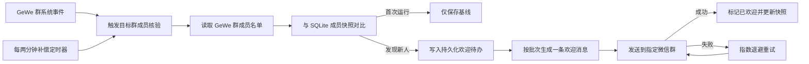

# 微信群新人自动欢迎设计

## 目标

当“AI流程与组织变革交流二群”出现新成员时，小詹自动发送一次欢迎消息，介绍自身能力，并明确说明在群里 `@小詹` 即可唤起。单人单独欢迎；同一批多人合并为一条消息。

## 范围

- 仅对本地配置绑定的目标微信群稳定标识生效，群名只用于人工识别和启动校验。
- 首次启用时只建立当前成员基线，不补发历史欢迎。
- 不改变其他微信群、个人微信单聊、飞书、钉钉和企业微信的回复规则。
- 不在日志、审计或远端仓库中记录真实群标识、成员微信 ID 或其他个人标识。

## 推荐架构

采用“系统事件快速触发 + 群成员名单周期核验”的双通道检测：

1. GeWe v1 的 `MsgType=10000`、v2 的 `SYSTEM` 群系统消息到达时，立即触发目标群成员核验。
2. 独立的轻量定时器每两分钟核验一次成员名单，补偿系统消息缺失、格式变化或服务短暂离线。
3. 使用 GeWe 官方 `getChatroomMemberList` 接口取得成员稳定标识、群昵称和微信昵称。
4. 将当前成员集合与 SQLite 中的上次快照对比；首次快照只建立基线，后续新增项才进入欢迎队列。

## 数据流

## 欢迎文案

> 欢迎 {新人姓名} 加入「AI流程与组织变革交流二群」👋  
> 我是小詹，詹老师的个人 AI 数字人。我可以围绕 AI、流程管理和组织变革答疑，阅读群里的图片、文件和链接，协助产出方案、报告、流程图及交付文件，也能承接明确任务持续执行。  
> 需要我时，直接在群里 **@小詹** 即可唤起我。

当同一轮发现多名新人时，将姓名使用中文顿号连接，只发送一条欢迎消息。

## 一致性与去重

- 成员快照和欢迎状态存入现有 SQLite `settings`，不新增外部数据库。
- 去重依据为目标群稳定标识与成员稳定标识的不可逆摘要，原始标识不进入审计日志。
- 欢迎任务状态至少包含 `pending`、`sending`、`sent`；只有发送成功才进入 `sent`。
- Webhook 重复、服务重启、周期核验重复返回不会重复创建已发送任务。
- 发送失败保留任务并按指数退避重试，不向群里发送“稍后再试”等无效提示。

## 异常处理

- GeWe 离线或名单接口失败：记录脱敏错误，保留旧快照，等待下一次核验。
- 群名校验失败：停止欢迎发送并告警，避免群标识误配后发到其他群。
- 新成员缺少昵称：使用“新朋友”作为展示名，但仍以稳定标识去重。
- 新成员批次发送失败：整批保持待办，恢复后仍只发送一次。
- 首次启用或本地状态丢失：重新建立基线，不对全群补发欢迎。

## 工程验证

自动化测试覆盖：

- GeWe v1、v2 系统事件能触发核验，普通消息不触发额外核验。
- 首次成员快照不发送欢迎。
- 单个新人单独欢迎，多名新人合并欢迎。
- 非目标群永不发送。
- 重复事件、重复名单和服务重启不重复欢迎。
- 发送失败进入重试，成功后停止重试。
- 名单接口失败不破坏已保存快照。
- 欢迎文案明确包含 `@小詹`、能力介绍和目标群名称。

上线验收不向现有群成员补发测试消息；通过合成事件、真实名单只读基线、运行状态和审计记录验证，下一位真实新人入群时自动触发正式欢迎。
