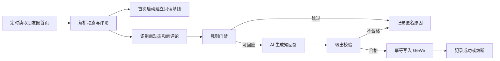

# 个人微信朋友圈精选自动互动设计

## 背景与目标

个人微信已经通过 GeWe 接入 AIPRO。新增能力需要覆盖三类朋友圈互动：

1. 对好友新发布的朋友圈主动留下有内容的评论。
2. 对别人评论自己朋友圈的内容进行回复。
3. 对别人回复数字人在好友朋友圈下评论的内容继续回复。

目标不是机械刷存在感，而是形成持续、自然、有边界的真实互动。系统不得虚构詹老师亲历、关系、地点、承诺或观点，也不得为了逃避平台检测而伪装设备、网络、节奏或身份。

## 方案比较

### 方案 A：所有可见动态无差别回复

实现最直接，但会把广告、投票、隐私、争议和无内容动态一并评论，容易产生骚扰、错话和重复话术，不采用。

### 方案 B：精选自动互动（采用）

系统读取新动态和评论线程，由规则门禁与 AI 共同判断是否值得回复。自己的朋友圈收到真实评论时优先回复；好友新动态只在内容明确、能够提供具体回应时评论。全程自动执行，但受每日预算、单人预算、幂等和熔断控制。

### 方案 C：只生成草稿，Owner 审批后发送

风险最低，但不能满足持续自动互动的目标。保留为未来可切换模式，不作为本次默认。

## 数据与接口

使用 GeWe 现有接口：

- `/gewe/v2/api/personal/getProfile`：读取自己的 wxid 和昵称。
- `/gewe/v2/api/sns/snsList`：读取朋友圈首页动态。
- `/gewe/v2/api/sns/snsDetails`：读取某条动态和完整评论线程。
- `/gewe/v2/api/sns/commentSns`：发表普通评论，或用 `commentId` 回复指定评论。
- `/gewe/v2/api/login/checkOnline`：写入前确认账号在线。

所有 Token 继续从 macOS Keychain 读取，不进入配置、日志、提示词或审计记录。

## 数据流

## 回复优先级

1. **自己的朋友圈收到新评论**：最高优先级。对每条非本人评论最多回复一次。
2. **别人回复数字人已有评论**：第二优先级。只有评论线程能明确关联到数字人的 `commentId` 时才回复。
3. **好友发布新朋友圈**：第三优先级。只对新发布且有明确正文、标题或可理解描述的内容主动评论。

首次启用只建立当前动态和评论基线，不追溯补评历史内容。后续只处理基线之后出现的新内容。

## 内容门禁

以下情况不自动评论：

- 纯广告、砍价、投票、群发、二维码和无上下文链接。
- 政治、宗教、医疗、法律、投资建议、未成年人、色情、违法、纠纷、指控、灾难和紧急求助。
- 只有表情、图片但系统没有可靠理解结果，或正文信息不足。
- 需要声称“我去过、我见过、我认识、我已经安排”等现实经历才能成立。
- 需要调用本地项目、客户、合作方或其他敏感知识才能回答。
- 已经回复过、同一作者当天已主动评论过，或达到每日预算。

系统不为了朋友圈闲聊过度检索本地 Wiki。只有动态提出明确专业或业务问题时才允许检索，并继续遵循隐私边界。

## 自然回复规则

- 默认 8–60 个中文字符，最多两句话。
- 必须抓住动态或评论中的一个具体细节，禁止“太棒了”“说得好”“学习了”等空泛模板。
- 可以自然、轻松、幽默，但不得冒充真实亲历或编造双方关系。
- 不主动销售、不塞链接、不引导私聊、不重复宣传数字人能力。
- 对直接提问先回答问题；对分享类内容可给具体观察或自然追问，但最多一个问题。
- 输出只允许纯文本，不带 Markdown、标签、来源说明或系统解释。

## 节奏与防重复

这些限制用于质量控制和防骚扰，不用于规避平台监控：

- 每 30 分钟扫描一次，启动时立即进行只读基线或增量扫描。
- 好友新动态：每天最多主动评论 6 条，同一作者每天最多 1 条。
- 评论线程回复：每天最多 20 条，同一条朋友圈最多连续回复 4 次。
- 只处理最近 36 小时的动态。
- 每个“动态 + 评论目标”使用持久化幂等键，成功后永不自动重复。
- GeWe 写操作失败后标记结果不确定，不自动重试，避免重复评论。
- 账号离线、接口风控提示、连续 3 次扫描失败或当日写入错误达到 2 次时立即熔断，等待人工检查或次日恢复。

## 状态与隐私

在现有本地 SQLite 状态中保存：

- 首页游标与首次基线时间。
- 已见动态 ID、已见评论 ID、本人评论 ID。
- 每日主动评论与线程回复计数。
- 最近失败、熔断日期和匿名审计事件。

审计日志不保存朋友圈正文、评论正文、好友昵称或明文 wxid，只保存散列标识、动作类型、跳过原因和错误摘要。

## 运行与开关

新增独立配置：

- `geweMomentsEngagementEnabled`
- `geweMomentsScanIntervalMs`
- `geweMomentsMaxProactivePerDay`
- `geweMomentsMaxRepliesPerDay`
- `geweMomentsMaxThreadDepth`
- `geweMomentsPostMaxAgeHours`

朋友圈 worker 与现有 GeWe 通道共用已登录账号、Token、状态库和 AI runtime。关闭开关后立即停止扫描，不影响微信收发消息、早报和新人欢迎。

## 错误处理与测试

单元测试必须覆盖：

- 首次启动只建立基线，不发表评论。
- 新好友动态通过门禁后只评论一次。
- 空泛、敏感、过期、本人动态不会触发主动评论。
- 自己朋友圈的新评论会按 `commentId` 回复一次。
- 对方回复数字人评论时能继续回复。
- 每日预算、单作者预算、线程深度和熔断生效。
- AI 输出虚构经历、过长、含 Markdown 或空泛模板时被拒绝。
- API 写入失败不会自动重复。
- Token、正文、昵称和 wxid 不进入审计日志。

上线验证只做真实接口只读探测和合成写入测试，不向任何真实朋友圈发送测试评论。启用后由下一条符合条件的新动态或新评论触发第一次正式互动。
