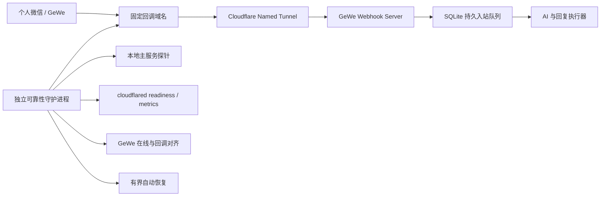

# 个人微信生产级可靠性加固设计

## 背景

当前个人微信链路由 GeWe REST/Webhook、Cloudflare Quick Tunnel、本机 Node.js 主服务、SQLite 持久队列和 LaunchAgent 组成。2026-08-22 的事故中，主服务和 GeWe 账号健康检查仍显示在线，但 Quick Tunnel 已经持续断开，公网消息没有进入本地回调端口。现有监控把“账号在线”和“本地监听存在”误当成端到端健康，形成假绿色状态；心跳失败只记日志，不触发隧道重建、回调重注册或服务恢复。

同时，LaunchAgent 直接运行当前 Git 开发工作区。开发文件、未提交改动、运行配置、SQLite、日志和生产进程共享目录，无法保证版本可追溯、原子发布或可靠回滚。服务器还允许自动休眠，会直接中断公网回调。

Cloudflare 官方明确说明 Quick Tunnel 仅用于测试和开发，不提供 SLA；生产回调应使用固定域名的 Named Tunnel。Named Tunnel 单个连接器会建立四条到至少两个 Cloudflare 数据中心的连接，并可通过额外副本扩展主机级高可用：

- <https://developers.cloudflare.com/cloudflare-one/networks/connectors/cloudflare-tunnel/do-more-with-tunnels/trycloudflare/>
- <https://developers.cloudflare.com/tunnel/configuration/>
- <https://developers.cloudflare.com/tunnel/monitoring/>

## 目标与可靠性边界

### 目标

- 淘汰 Quick Tunnel，使用固定域名的 Cloudflare Named Tunnel。
- 端到端健康必须验证“公网边缘 → Tunnel → 本地回调”，不能仅检查进程或账号。
- 进程、隧道、回调注册或网络恢复后，无需人工点击即可自动恢复。
- 自动恢复有连续失败门槛、指数退避、随机抖动和熔断，避免重启风暴。
- 开发工作区、构建目录、生产版本和可变运行数据物理隔离。
- 每次发布对应 Git 提交与版本标签，支持原子切换和一键回滚。
- 用故障注入证明杀进程、断隧道、回调漂移、DNS 抖动和错误版本均可检测或恢复。

### 建议 SLO

- 正常情况下，公网回调探针每 15 秒执行一次。
- 单次抖动不触发恢复；连续 3 次失败后 45 秒内进入 `degraded`。
- 可恢复的本机进程或 Tunnel 故障，在网络恢复后 5 分钟内自动恢复。
- 回调恢复后连续 3 次成功才进入 `healthy`。
- 接收到 HTTP 回调后，必须在持久入队成功后快速返回 2xx；业务处理异步执行。
- 本地已接受的消息保持现有幂等与持久重试语义，不因重启重复回复。

### 无法由本机单方面保证的边界

GeWe 是第三方个人微信接口，并非腾讯官方开放 API。若 GeWe 本身掉线、封号、丢弃事件，或不提供失败投递查询/重放，本机无法恢复从未收到的消息。生产监控必须把 `provider_down` 与 `local_ingress_down` 分开，不能把第三方故障伪装成本机健康，也不能承诺不存在的消息补拉能力。

成熟 webhook 平台通常要求失败投递可查询和重放；例如 GitHub 明确建议定期检查失败投递并重新投递。若 GeWe 后续提供等价 API，再增加补偿拉取器：

- <https://docs.github.com/en/webhooks/using-webhooks/handling-failed-webhook-deliveries>

## 方案选择

### 方案 A：当前服务器单机生产化（本期采用）

使用固定 Named Tunnel、独立可靠性守护进程、不可变生产版本目录和外置运行状态。改动可控，可以最快解决当前已发生的故障类型，并为第二节点保留接口。

### 方案 B：双机主备（后续阶段）

第二台服务器运行同一 Named Tunnel 的副本，使用带租约的唯一主节点消费消息。该方案还需要共享队列或明确的主从接管、SQLite 复制、AI 运行时与文件产物同步，否则可能造成重复回复。本期只预留节点标识和 leader 状态，不直接上线。

### 方案 C：整套迁移到云主机（暂不采用）

可以消除本机休眠风险，但需要迁移 Codex、Keychain、知识库、文件能力和 SQLite，范围大于本次可靠性修复。

## 总体架构



### 组件边界

1. **主消息服务**：只负责回调接收、持久入队、业务处理和回复，不负责拉起自身。
2. **cloudflared LaunchAgent**：运行 remotely-managed Named Tunnel，使用固定域名和 Keychain 中的最小权限 Tunnel Token。
3. **可靠性守护进程**：独立 LaunchAgent，不能与主服务共享进程生命周期。负责分层探针、状态机、恢复协调、审计和告警。
4. **Dashboard**：只展示守护进程产生的事实状态，不自行推断“账号在线 = 回调正常”。人工重启复用同一恢复协调器。
5. **发布器**：从干净 Git 提交构建不可变版本，完成验证后原子切换 `current`，禁止生产进程指向开发 worktree。

## 端到端探针

每 15 秒执行一次分层检查，单层独立记录时间、耗时、连续成功/失败和脱敏错误码。

### L1：主进程与本地回调

- 校验 LaunchAgent 定义、PID、入口文件和工作目录属于当前生产版本。
- 请求 `127.0.0.1` 内部健康端点。
- 检查回调端口已监听。
- 检查 SQLite `quick_check` 与持久队列可写性。

### L2：Tunnel 连接器

- cloudflared 使用固定 metrics 地址，不再依赖动态的 20241–20245 端口。
- 检查 `/ready` 或等价 readiness、活动连接数、连接边缘地址和最后成功时间。
- 当前网络已证实 IPv6 边缘不稳定，因此默认固定 IPv4；协议保留 QUIC，若连续传输故障则允许有界切换 HTTP/2。

### L3：公网回环探针

- 可靠性守护进程向固定回调域名的专用 canary 路径发送随机 nonce。
- 请求必须真实经过 Cloudflare，再由本地回调服务签名返回 nonce 摘要。
- canary 路径与 GeWe webhook 路径分离，不进入业务队列，不暴露 callback secret。
- 只有公网回环成功才能认定 `publicCallbackReachable=true`。

### L4：GeWe Provider

- 调用 `checkOnline` 判断账号是否在线。
- 周期性幂等调用 `setCallback` 对齐固定回调 URL；启动、Tunnel 恢复和连续回调失败后立即重注册。
- 区分认证失败、账号离线、DNS/网络失败、API 5xx、限流和回调不一致。
- 若 GeWe 没有“读取当前回调地址”接口，则 `callbackRegistered` 表示最近一次注册成功及其时间，不能表示永久有效。

## 健康状态模型

状态为：

- `starting`：服务启动或发布切换中。
- `healthy`：L1–L4 全部成功，且最近 3 次公网探针连续成功。
- `degraded`：至少一层连续 3 次失败，但仍在恢复预算内。
- `recovering`：已执行重启、重注册或回滚，等待条件满足。
- `provider_down`：本地与 Tunnel 正常，但 GeWe API/账号异常。
- `circuit_open`：同一故障在恢复窗口内超出预算，暂停主动重启并持续探测。
- `offline`：主服务和回调均不可用。

Dashboard 的个人微信卡片分别展示：

- 账号认证与在线状态；
- 本地回调监听；
- Named Tunnel 活动连接数；
- 公网回环探针状态与最近成功时间；
- 回调最近注册成功时间；
- 最近入站、最近回复、最近恢复动作；
- 当前状态、连续失败数、下一次恢复时间和熔断状态。

不得再使用单一 `connected` 布尔值覆盖上述事实。

## 自动恢复状态机

### 判定门槛

- 单次失败：记录但不恢复。
- 连续 3 次同层失败：进入 `degraded` 并开始一次恢复序列。
- 失败类型变化时重新分类，但不清空全局恢复预算。
- 恢复后连续 3 次成功才清零失败计数。

### 恢复顺序

1. L1 失败：先用已有服务协调器校验 LaunchAgent；定义漂移则重新 bootstrap，定义正常则 kickstart。
2. L2 失败：重启 cloudflared LaunchAgent，等待 readiness 与至少一条活动连接。
3. L3 失败但 L1/L2 正常：重启 Tunnel 一次；成功后重注册 GeWe 回调。
4. L4 回调注册失败：在不重启主服务的前提下重试 `setCallback`；认证失败或账号离线不进行重启风暴。
5. 新版本部署后健康失败：自动切回上一个已验证版本并重新加载 LaunchAgent。

### 退避与熔断

- 恢复间隔：10 秒、30 秒、60 秒、120 秒、300 秒。
- 每次加入 10%–25% 随机抖动。
- 15 分钟内最多执行 5 次相同破坏性恢复动作。
- 超限后进入 `circuit_open` 15 分钟，只保留无副作用探针。
- 网络恢复或连续 3 次成功后关闭熔断。
- 每个恢复动作带幂等键和锁，同一时刻只能有一个协调器修改服务状态。

## 回调接收与消息语义

- Webhook 请求先完成路径认证、请求体上限和 JSON 结构校验。
- 以 `appId + messageId` 为幂等键，在 SQLite 事务中持久入队。
- 只有持久入队成功才返回 2xx；入队失败返回非 2xx，让支持重试的 Provider 有机会重投。
- 业务处理与 HTTP 响应解耦，避免 AI 延迟阻塞 Provider。
- 重复投递命中唯一键后返回成功但不重复处理。
- 服务启动只恢复 `queued/retry/processing-stale`，不回放 `completed/dead`。
- 若 Provider 不支持失败投递查询，不伪造历史补发；Dashboard 明确标注“断线窗口可能存在不可恢复的上游漏投”。

## Git、发布与运行隔离

### 目录布局

```text
开发仓库/
  .worktrees/<feature>/          独立功能分支

~/Library/Application Support/AIPRO/
  config/                        可变配置，不进 Git
  data/                          SQLite、备份和运行状态
  logs/                          主服务、Tunnel、守护进程日志
  releases/<version>/            不可变生产版本
  current -> releases/<version>  原子切换符号链接
  previous -> releases/<version> 回滚目标
```

### 发布规则

- 功能只在 `codex/wechat-production-reliability` 等独立分支开发。
- 合并前必须通过语法检查、全量测试、安全检查和可靠性故障注入。
- 发布产物只来自干净提交，写入提交 SHA、构建时间和文件哈希清单。
- 生产目录不包含 `.git`、测试缓存、开发日志、未跟踪文件、Keychain 内容或 `config.local.json`。
- 发布前验证新版本，随后原子更新 `current` 并重载正式 LaunchAgent。
- 新版本未在限定时间内达到 `healthy` 时自动恢复 `previous`。
- LaunchAgent 的入口、工作目录、日志目录和状态目录都必须与生产布局一致；Dashboard 重启前继续校验定义漂移。
- 当前脏开发工作区保持原样，不作为生产发布源，也不被自动清理。

## 服务器电源与进程管理

- 生产服务运行期间必须阻止系统睡眠；优先由专用服务器电源策略保证，LaunchAgent 额外使用受控的 `caffeinate` 兜底。
- 屏幕休眠不影响服务，但系统睡眠、注销用户或关机会中断 LaunchAgent。
- 主服务、Tunnel、可靠性守护进程和 Dashboard 使用独立 LaunchAgent 标签。
- 每个进程有独立日志、固定 metrics/health 端口和有限日志轮转。
- 不允许测试脚本调用真实生产 launchctl；所有故障注入使用隔离标签、临时端口和 stub 控制面，只有最终受控验收操作真实服务。

## 凭据与安全

- GeWe Token、回调 secret、Named Tunnel Token 只存 macOS Keychain。
- Cloudflare Token 只授予单个 Tunnel 运行权限，不授予全账户管理权限。
- 固定域名只暴露 webhook、canary 和现有临时文件路由；其他路径默认 404。
- canary 使用短期 nonce 与 HMAC，拒绝重放和超时请求。
- 日志与审计不记录联系人 ID、消息正文、回调路径 secret、Tunnel Token 或完整公网 URL 查询参数。
- 生产发布清单记录哈希，不包含密钥或本地绝对隐私路径。

## 故障注入与验收

### 自动化测试

1. 健康状态机：连续失败门槛、连续成功恢复、退避、抖动和熔断。
2. 分层诊断：L1–L4 的单点与组合故障返回正确根因。
3. 恢复协调：Tunnel 重启、主服务重启、回调重注册和发布回滚顺序。
4. 并发安全：多个故障同时出现时只执行一个破坏性动作。
5. Git 发布：脏提交拒绝发布、版本清单、原子切换和回滚。
6. Dashboard：不再把账号在线误显示为端到端健康。
7. 安全：canary 鉴权、密钥脱敏、测试禁止触碰生产 launchctl。

### 隔离 smoke

- 杀死模拟主进程，验证 LaunchAgent 恢复。
- 杀死模拟 cloudflared，验证 Tunnel 恢复和回调重注册。
- 让本地端口存在但公网路由失败，验证假健康被识别。
- 注入 DNS 失败和连接超时，验证退避而非高频重启。
- 注入错误回调 URL，验证自动对齐。
- 注入连续失败超过预算，验证熔断。
- 发布一个健康失败版本，验证自动回滚。

### 真实受控验收

1. 从干净 Git 版本发布至独立生产目录。
2. 切换固定 Named Tunnel 域名并成功注册 GeWe 回调。
3. 外部公网 canary 连续成功。
4. 人工杀死一次 cloudflared，确认无需人工操作即可恢复。
5. 发送个人微信测试消息，确认 `received → durable enqueue → AI → send → replied`。
6. 重启主服务，重复消息不二次回复。
7. Dashboard 正确显示恢复时间、动作和各层状态。
8. 验证回滚命令可恢复上一个版本。

## 上线顺序

1. 先实现状态模型、探针和 Dashboard，只观察不恢复。
2. 建立 Named Tunnel 与固定域名，保留 Quick Tunnel 作为短期人工回退，不并行注册回调。
3. 开启 callback 自动对齐和 Tunnel 有界恢复。
4. 建立生产发布目录并将 LaunchAgent 从开发工作区迁移到 `current`。
5. 开启主服务自动协调与发布回滚。
6. 完成真实故障注入后移除 Quick Tunnel LaunchAgent。
7. 稳定运行一段时间后再评估第二节点与主节点租约。

## 回滚

- Named Tunnel 切换失败：恢复旧回调 URL 和旧 Tunnel LaunchAgent，但保持新的只读监控。
- 守护进程误恢复：关闭自动动作，仅保留探针和告警。
- 新版本不健康：原子切回 `previous`，重新 bootstrap 正式 LaunchAgent。
- 数据库 schema 变更必须保持向后兼容；本期可靠性状态优先复用 `settings/audit`，避免不可逆迁移。

## 成功标准

- Dashboard 不再出现“公网回调断开但微信显示健康”。
- Tunnel、主服务或回调注册单点故障无需人工重启即可恢复。
- 生产进程不再引用开发仓库或任何 feature worktree。
- 任意在线版本可追溯到 Git 提交并能回滚。
- 全量测试、129 项机制验收、可靠性专项测试和真实故障注入全部通过。
- 对 GeWe Provider 自身掉线明确告警，并且不会用本地重启掩盖第三方故障。
